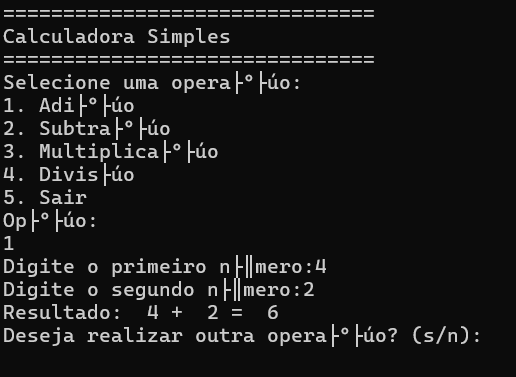

# :abacus: Calculadora Baseada em C

## :book: Descrição 

Uma calculadora simples em linguagem C que permite realizar operações matemáticas básicas, como adição, subtração, multiplicação e divisão, diretamente do terminal.


---

## :camera: Demonstração

> *Imagem de exemplo da calculadora em execução no terminal*

---

## :hammer_and_wrench: Pré-requisitos e Instalação
Antes de executar o projeto, vocẽ precisa ter:

- :computer:[CodeBlocks](http://www.codeblocks.org/downloads) instalado (que inclui o compilador C) 
- Ou um terminal com o **GCC** instalado (caso queira rodar fora do CodeBlocks)


## :arrow_forward: Para compilar no CodeBlocks:

1. Abra o CodeBlocks e carregue o arquivo `calculadora.c`.
2. Clique no botão "Build" ou pressione **F9** para compilar o código.
3. Após compilar, clique em **Run** ou pressione **Ctrl + F10** para executar.

## :gear: Para rodar no CodeBlocks:

1. Após compilar, clique em "Run" ou pressione **Ctrl+F10"** para executar o programa.

SE você preferir rodar a partir do terminal, você pode usar o `gcc`(caso tenha o complilador instalado), no terminal, execute:

## :memo: Como Usar
Após executar o programa, vocẽ verá um menu no terminal para escolher a operação desejada.

### Exemplo:

Escolha a operação:
1. Soma
2. Subtração
3. Multiplicação
4. Divisão 
   Opção: 1
   Digite o primeiro número: 10
   Digite o segundo número: 5
   Resultado: 15 

## :open_file_folder: Estrutura do Projeto

Aqui está a estrutura de diretórios e arquivos principais do projeto:

```

calculadora-em-c/
|── calculadora-em-c
|── README.md
|── LICENSE
|── assets
   |── demo.png

```

### Principais Arquivos

- `calculadora.c` : Código-fonte principal da calculadora.
- `README.md` : Documento explicativo do projeto.
- `LICENSE` : Arquivo com a licença de uso do projeto.
- `assets/` : Contém imagens utilizadas no README.
 
## :page_facing_up: Licença

Esse projeto está licenciado sob Licença MIT - veja o arquivo [LICENSE](LICENSE) para mais detalhes.

## :technologist: Para rodar via terminal (Linux/macOS):

```bash
gcc calculadora.c -o calculadora
./calculadora
